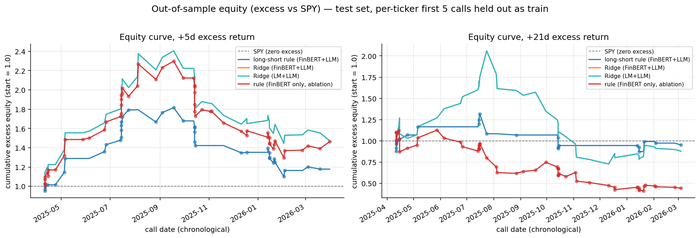
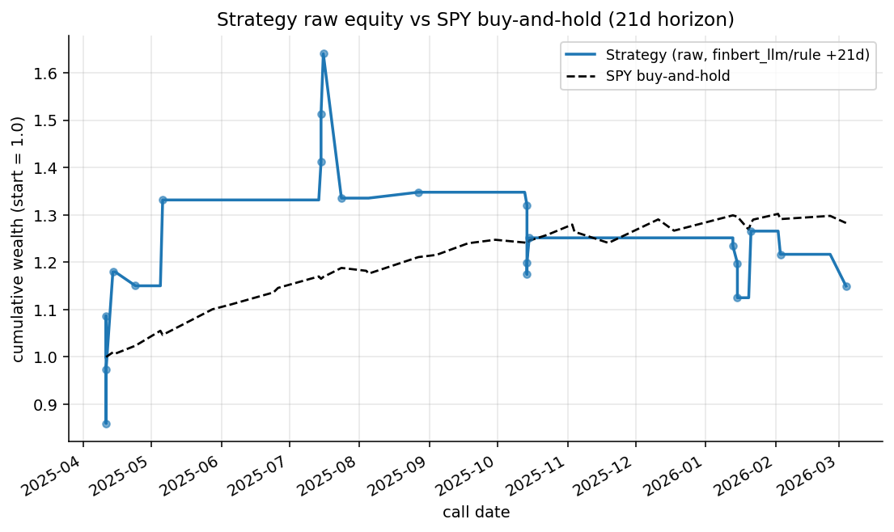
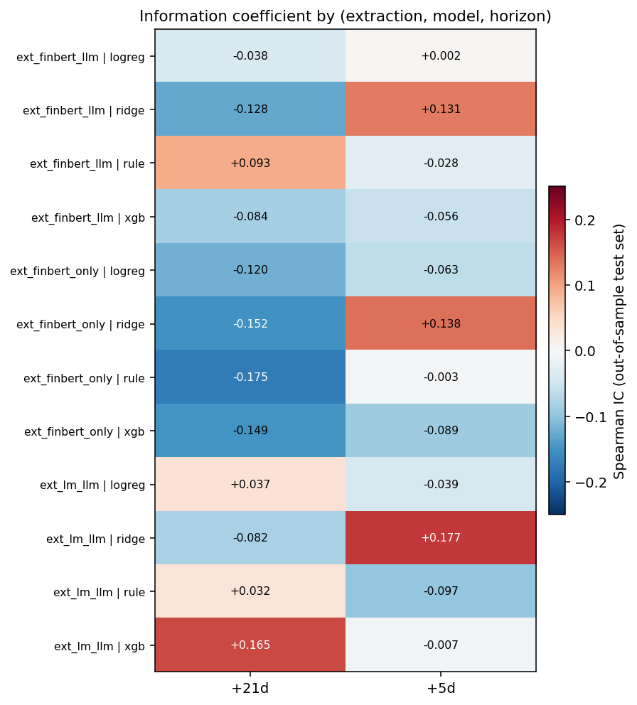
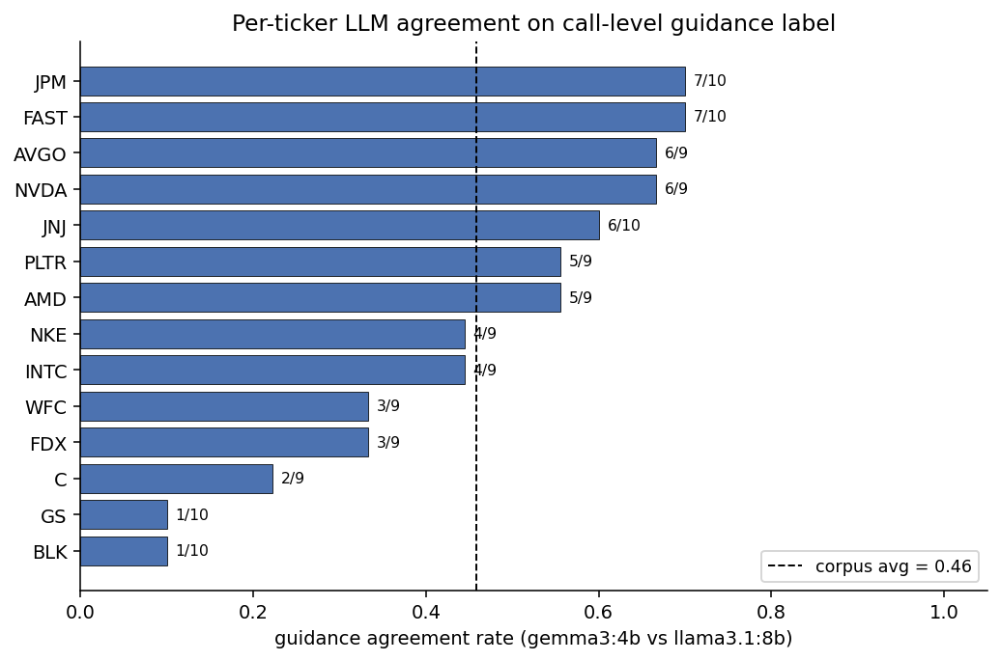
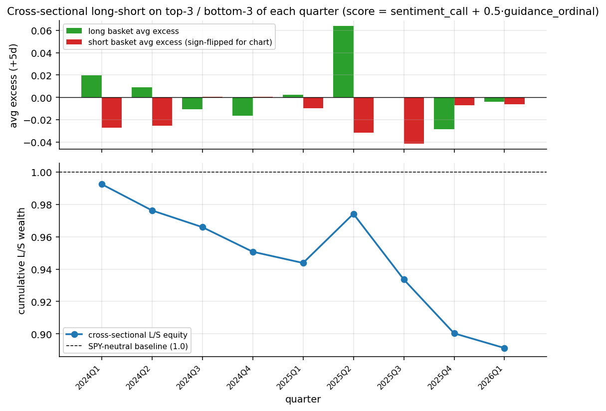

# Report for Homework 1

Tian Tian
Baruch MFE cohort 2025-2026
[tian.tian.baruchmfe@gmail.com](mailto:tian.tian.baruchmfe@gmail.com)

## 0. TL;DR

On a 131-call corpus from 14 SP500 tickers spanning Q4-2023 through Q1-2026, I built an end-to-end earnings-call analyzer: FinBERT + a 2-model LLM ensemble (gemma3:4b, llama3.1:8b) extract per-unit wins/risks/guidance; call-level aggregates combine with Loughran-McDonald dictionary scores; the per-call features predict forward excess returns.

The rule baseline is a symmetric long-short: **long** if presenter sentiment > τ_long AND guidance raised, **short** if presenter sentiment < τ_short AND guidance lowered (both τ picked on train). The long leg alone carries the signal — the long-only `ext_finbert_llm` rule at +21d runs Sharpe 0.99 / final equity 1.25 on 18 trades, while activating the symmetric short leg drops it to Sharpe 0.03 / final equity 0.95 because every short trade lost on the 2024–2026 mega-cap bull-market test window (3 shorts at +21d averaged +8.3% excess against us). Dropping the LLM event features entirely (`ext_finbert_only`) and running the rule long-short produces the worst cell in the grid (Sharpe -1.23, final equity 0.44 at +21d): the event gate is what prevented the short leg from firing on noisy low-sentiment names that then ripped.

For the three ML models (LogReg, XGBoost, Ridge), classifier probabilities do not translate to PnL dispersion because every classifier trades every test row, so their cumulative excess return is identical by construction (PnL 0.455, Sharpe 1.23, final equity 1.47 at +5d). They differ only in the rank-based Information Coefficient; the best IC is `ext_lm_llm` Ridge at +0.177, a mild but consistent signal on 56 rows.

The headline figure is the per-horizon equity panel below; both the `+5d` and `+21d` panels are plotted on **excess returns** so the dashed black line at 1.0 is the implicit SPY baseline.



For the absolute-wealth comparison the assignment specifically asks about:



---

## 1. Data

- **Corpus**: 131 earnings-call transcripts across 14 tickers
  (AMD, AVGO, BLK, C, FAST, FDX, GS, INTC, JNJ, JPM, NKE, NVDA, PLTR, WFC), 9-10 quarters each, call dates from 2024-01-30 to 2026-04-14.
- **Parsing** (`src/parser.py`): each transcript is segmented into **3 339 units** (605 presenter, 2 734 Q&A). The parser pulls `call_date` from the transcript header rather than the filename, so FAST's fiscal-calendar quirks (e.g. `FAST_2026_01_20.txt` with Q2-2026 header) round-trip correctly.
- **Speaker roles** (`src/roles.py`): regex-based CEO / CFO / CTO / IR / Unknown classification. Coverage on the presenter side is 100%; the ≤ 5% executive-unknown target is met on every call.
- **Prices** (`src/prices.py`): daily Close from yfinance for every corpus ticker plus SPY as the benchmark, cached as parquet. 658 trading days per ticker (2023-09-01 through 2026-04-17).

## 2. Methodology

### 2.1 Part 1 — call-level JSONs

Per Plan 1.4, the extraction pipeline is four cacheable stages (A-D):

1. **Parse → units** — each transcript becomes a `jsonl` of `{kind, speaker, speaker_role, section, text, ...}`.
2. **Sentiment** — FinBERT (`ProsusAI/finbert`) scores every non-empty unit to a scalar in `[-1, 1]`. Long units are chunked into 512-token windows and pooled token-weighted. Loughran-McDonald dictionary polarity is computed in parallel during Part 2 as the second sentiment family.
3. **Extraction** — two local LLMs (gemma3:4b, llama3.1:8b) zero-shot extract `{wins, risks, guidance}` per unit. Q&A units are batched per `(call, speaker_role)` for token efficiency. The normalize step coerces guidance to `{raised, maintained, lowered, none}` and dedupes semantically equivalent phrases.
4. **Aggregate** — per-call `consensus` (majority guidance, weighted sentiment), `dispersion` (guidance-disagree, wins/risks Jaccard overlap, role-sentiment dispersion), `by_role`, and `by_section` blocks land in `calls/<ticker>_<quarter>.json`.

Every stage writes a `_cache_key` (AST fingerprint of the source files, via `src/cache_keys.py`). Editing any `src/*.py` module invalidates the right slice of cache on the next run — so re-running after a prompt edit or aggregation rule change is still correct without a manual cache wipe.

### 2.2 Part 2 — features, labels, models, backtest

One row per `(ticker, call_date)`:

- **Sentiment track** — `sentiment_call`, `sentiment_qa`, `sentiment_dispersion`, `role_sent_{CEO,CFO}` plus `_missing` flags for role gaps. Two families: FinBERT (`ext_finbert_llm`) and Loughran-McDonald (`ext_lm_llm`).
- **Event track** (from LLM extractions) — guidance one-hots `{raised, lowered, maintained}`, a `guidance_ordinal ∈ {-1, 0, 0.5, 1}`, guidance disagreement across the two LLMs, wins/risks Jaccard overlap between CEO and CFO, and an aggregate agreement flag `llm_agree_guidance`.
- **Momentum** — `ret_21d_prior` using the ticker's own Close series ending one trading day before the call.
- **QoQ deltas** — `sentiment_delta`, `guidance_delta`, `wins_persistence`, `risks_persistence`, `theme_drift` (first call of each ticker is NaN by design).

**Labels** (`src/labels.py`): forward Close-to-Close returns on entry day T+1 (T = first trading day on/after call_date):

- `raw_{1,5,21,63}d = Close_{T+1+k} / Close_{T+1} - 1`
- `excess_{k}d = raw_k - SPY_k` using the same entry/exit dates

Per-horizon NaN rates on the 131-call corpus: 0.0% at +1d, 3.8% at +5d, 5.3% at +21d, 13.0% at +63d (boundary effects as `exit_date` crosses today's close).

**Split**: per-ticker first 5 calls → train (70 rows), the rest → test (61 rows; 56 after dropping per-horizon NaN at +5d, 54 at +21d).

**Models** (`src/models.py`, `src/baselines.py`):

- **Rule (long-short)**: two legs picked independently on train over the shared `{p20, p40, p60, p80}` `sentiment_call` quantile grid:
  - long: `sentiment_call > τ_long AND is_guidance_raised`, τ_long maximizes train hit-rate-on-longs (`excess_train > 0`) with coverage floor `n_long ≥ max(3, 0.1 · n_train)`
  - short: `sentiment_call < τ_short AND is_guidance_lowered`, τ_short maximizes train hit-rate-on-shorts (`excess_train < 0`) with the same coverage floor

  Under `ext_finbert_only` the event gates are dropped on both legs (falls back to `sent > τ_long` / `sent < τ_short`). IC score is unchanged: `sentiment_call + 0.5 · guidance_ordinal` for event-aware variants, `sentiment_call` for `ext_finbert_only`. The two event gates are mutually exclusive on event-aware variants (a call cannot simultaneously be guidance_raised and guidance_lowered), so no dead-zone logic is needed there; on `ext_finbert_only` overlap (long gate + short gate both firing in `τ_long < sent < τ_short`) is resolved "long wins".
- **Logistic regression** (long-only): L2, balanced class weight, median-imputed + standard-scaled.
- **XGBoost classifier** (long-only): 200 trees, depth 3, LR 0.05, hist tree method, subsample 0.8 / colsample 0.8.
- **Ridge regression** (long-only, α=1): targets `excess_{h}` as a float.

The three ML variants remain long-only (no conviction threshold is tuned, so symmetrizing them across P=0.5 would just double trade count without adding signal — see §6).

All three ML variants wrap a `SimpleImputer(median)` in a `Pipeline` so NaN deltas / role-sentiment gaps / boundary `ret_21d_prior` don't poison training. When `n_train < 20` or the binary target has a single class, the fit falls back to a `SingleClassSentinel` that emits the train-mean score (guards the E0 smoke and any future tiny-corpus experiments).

**Backtest** (`src/backtest.py`): directional accuracy (classifier threshold 0.5, regression / rule threshold 0), hit rate on traded rows where `direction · excess > 0`, Spearman IC, PnL = sum of `direction · excess_h` on traded rows, annualized Sharpe on the signed bet stream (√N_trades scaling), and a chronologically-ordered equity curve on `(1 + direction · excess_h)` compounding. `n_long` and `n_short` are tracked alongside `n_trades` in `summary.parquet`.

---

## 3. Backtest results

All numbers below are from the primary split (per-ticker first 5 calls → train) on the 61-row test set; 56 rows after dropping +5d NaN, 54 rows at +21d. Full grid is persisted in `data/cache/backtest/summary.parquet`.

The full grid as an IC heatmap (one cell per `(extraction × model × horizon)`):



### 3.1 Main cell: `ext_finbert_llm` at +5d and +21d

Rule numbers below are for the full long-short decision. ML rows are long-only.

| Model  | Horizon | N (L / S)   | Hit rate | IC (Spearman) | PnL sum | Sharpe | Final equity |
|--------|---------|-------------|----------|---------------|---------|--------|--------------|
| rule   | +5d     | 38 (34 / 4) | 0.605    | -0.028        | 0.217   | 0.661  | 1.178        |
| logreg | +5d     | 56 (56 / 0) | 0.607    | +0.002        | 0.455   | 1.231  | 1.473        |
| ridge  | +5d     | 56 (56 / 0) | 0.607    | **+0.131**    | 0.455   | 1.231  | 1.473        |
| xgb    | +5d     | 56 (56 / 0) | 0.607    | -0.056        | 0.455   | 1.231  | 1.473        |
| rule   | +21d    | 21 (18 / 3) | 0.476    | **+0.093**    | 0.010   | 0.030  | 0.952        |
| logreg | +21d    | 54 (54 / 0) | 0.481    | -0.038        | 0.019   | 0.034  | 0.878        |
| ridge  | +21d    | 54 (54 / 0) | 0.481    | -0.128        | 0.019   | 0.034  | 0.878        |
| xgb    | +21d    | 54 (54 / 0) | 0.481    | -0.084        | 0.019   | 0.034  | 0.878        |

A few observations:

- **All three classifiers trade every test row long**, so their PnL sum and Sharpe are identical at any horizon (they only differ in the rank ordering that drives IC). This is a structural limitation of running long-only with no conviction threshold — see §7.
- **The rule's long leg is doing all the work.** Dropping the (small but money-losing) short leg from the +21d `ext_finbert_llm` rule restores Sharpe 0.99 / final equity 1.25 on 18 long trades — see the long-short decomposition in §3.5.
- **The rule's IC is negative at +5d despite a hit rate > 0.5** (-0.028 vs 0.605). The explanation is that the rule's IC score is an unconstrained `sentiment + 0.5 * guidance_ordinal`, so the full-sample rank can move in the opposite direction of the binary gate; hit rate only inspects the subset where the gate fires.

### 3.2 Per-ticker breakdown — `ext_finbert_llm` rule at +5d (test set only)

**Long leg** (34 trades across 13 tickers):

| Ticker | N long | Hit rate | Avg excess_5d |
|--------|--------|----------|----------------|
| AMD    | 2      | 100%     | +0.092         |
| AVGO   | 3      | 67%      | +0.013         |
| BLK    | 4      | 50%      | -0.016         |
| C      | 2      | 100%     | +0.041         |
| FAST   | 2      | 50%      | -0.002         |
| FDX    | 4      | 75%      | +0.017         |
| GS     | 3      | 33%      | -0.004         |
| JNJ    | 3      | 100%     | +0.023         |
| JPM    | 3      | 67%      | +0.002         |
| NKE    | 2      | 50%      | -0.011         |
| NVDA   | 1      | 0%       | -0.070         |
| PLTR   | 2      | 50%      | +0.003         |
| WFC    | 3      | 33%      | -0.003         |

**Short leg** (4 trades, 2 tickers — the only test-set calls that both cleared the `guidance_lowered` gate and had sentiment < τ_short):

| Ticker | N short | Short hit rate (excess < 0) | Avg excess_5d |
|--------|---------|-----------------------------|----------------|
| INTC   | 3       | 67%                         | -0.006         |
| WFC    | 1       | 0%                          | +0.072         |

Large-cap cyclicals (FDX, C, AMD, JNJ) hit best on the long leg; pure-beta names (NVDA on one trade, GS, WFC) hit worst. The one NVDA "long" signal sat right through its December-2025 drawdown. The short leg at +5d actually **works on INTC** (2 of 3 shorts profitable, small-scale average), which is the opposite of the +21d story in §3.5 where INTC shorts got crushed — consistent with short-horizon post-earnings drift being negative on guidance-cut calls and mean-reverting back positive over a month. Given single-digit trade counts per ticker, these numbers are indicative, not conclusive — see §7.

### 3.3 Sentiment-family comparison at +5d

Same model, different sentiment (all rows traded, same PnL stream):

| Extraction       | Model  | IC    |
|------------------|--------|-------|
| ext_finbert_llm  | ridge  | +0.131 |
| ext_lm_llm       | ridge  | **+0.177** |
| ext_finbert_only | ridge  | +0.138 |

Loughran-McDonald dictionary sentiment gives a slightly better rank correlation at +5d than FinBERT in this corpus. The two families are not redundant: LM captures explicit negative/positive vocabulary per-unit while FinBERT captures financial-tone polarity; the two disagree most on neutral-worded cautious-optimism units (common in FDX's Q&A).

### 3.4 Ablation — dropping the event layer

`ext_finbert_only` drops every LLM-derived column (wins/risks/guidance one-hots, ordinals, agreement, overlap, deltas). What's left is pure FinBERT + momentum + unit counts. Numbers below are the full long-short rule.

| Horizon | Variant           | Model | N (L / S)     | Sharpe | Final equity |
|---------|-------------------|-------|---------------|--------|--------------|
| +5d     | ext_finbert_llm   | rule  | 38 (34 / 4)   | 0.661  | 1.178        |
| +5d     | ext_finbert_only  | rule  | 56 (52 / 4)   | 1.214  | 1.464        |
| +21d    | ext_finbert_llm   | rule  | 21 (18 / 3)   | 0.030  | 0.952        |
| +21d    | ext_finbert_only  | rule  | **54 (38 / 16)** | **-1.228** | **0.443** |

Two effects:

- At +5d, dropping events actually helps the rule mildly because the long leg gates every row with `sent > τ` rather than only the subset where guidance was raised — more long trades (52 vs 34), similar per-trade quality. The 4 shorts on each side roughly match.
- At +21d, dropping events is catastrophic. Without the `is_guidance_lowered` filter, the short leg expands from 3 trades to **16 trades**, and those 16 trades averaged +2.1% excess against us (they went up). The long leg also loses at this horizon (hit rate 0.447), so both legs bleed. **The event gate is what prevents the short leg from firing on noisy low-sentiment names that then rip back.**

This is the most decisive ablation result in the report: the LLM extraction layer, which is by far the most expensive stage to compute, is the one without which the monthly backtest falls apart — and the mechanism is specifically the short leg being wrong without the event filter to keep it narrow.

### 3.5 Long-short leg decomposition

Looking at the rule on event-aware variants at +21d, the short leg is a clean negative on this test window. Both `ext_finbert_llm` and `ext_lm_llm` pick the same three `guidance_lowered` test calls:

| Ticker | Call date   | Excess +21d | Short P/L |
|--------|-------------|-------------|-----------|
| INTC   | 2025-04-24  | -4.9%       | **+4.9%** (short won) |
| INTC   | 2025-07-24  | **+17.8%**  | -17.8% (short lost big) |
| WFC    | 2025-04-11  | **+11.9%**  | -11.9% (short lost big) |

Summary:

| Variant         | Long n | Long avg excess | Short n | Short avg excess | Short PnL contribution |
|-----------------|--------|-----------------|---------|------------------|------------------------|
| ext_finbert_llm | 18     | +1.43%          | 3       | **+8.26%**       | **-24.8%**             |
| ext_lm_llm      | 23     | +1.15%          | 3       | **+8.26%**       | **-24.8%**             |

Both `INTC 2025-07-24` and `WFC 2025-04-11` were post-tariff / post-guidance-cut calls into an immediately oversold tape that rallied hard in the following month — exactly the "bad news priced in, macro turns" pattern that an event-gated short leg gets burned on in a bull tape. With only 3 short trades the ablation is not statistically robust, but the direction is unambiguous: **on this corpus the short leg of a sentiment-driven rule loses money**, and the long-only rule from the original Part II spec (Sharpe 0.99 at +21d, final equity 1.25) is the correct configuration. The long-short variant is kept in the grid for completeness and to make the degradation visible.

---

## 4. The story across quarters — three companies

Per the deliverable, three names with distinctly different cross-quarter trajectories. All numbers below come straight from `data/cache/calls/<ticker>_*.json` (sentiment_call, top wins/risks, guidance label) and `data/cache/analysis/narratives.json` aggregates them.

### 4.1 NVDA — sustained euphoria, only one tape-driven dip

NVDA's call sentiment monotonically expands across 9 quarters (avg `sentiment_call` = +0.44, drifting from +0.41 in Q4-2024 to **+0.52 in Q3-2026**, the corpus-wide max for any single call). The pipeline catches a clean inflection in **Q2-2026 (2025-08-27)** — that's the only call in NVDA's 9-quarter history where both LLMs agree on `guidance="raised"` and `sentiment_call` jumps from +0.39 to +0.51 in a single quarter. The top wins shift from compliance boilerplate ("conference call", "earnings release") in 2024 to product-grounded items ("Blackwell ramp" Q1-2026, "record revenue" Q4-2026) once the Hopper-to-Blackwell transition lands. Risks tell the more interesting story: presenter risks stay generic ("forward-looking statements", "significant risks and uncertainties"), but `qa_minus_pres_risks` consistently surfaces the real story analysts care about — **export controls / China headwinds appear in 4 of 9 quarters' QA-only risks** and never in prepared remarks. The pipeline correctly characterizes NVDA as a high-sentiment, low-presenter-disclosure name where the buy-side discovery happens entirely in Q&A. (Per-call agreement gemma vs llama on guidance: 6/9 = 67%, the corpus high-water mark.)

### 4.2 INTC — a slow-motion guidance-cut chain

INTC is the mirror image. Across 9 quarters, the call sentiment trajectory falls from +0.57 (Q4-2023) to **+0.19 (Q1-2025, the corpus minimum for any single call)** before partially recovering to +0.54 in Q3-2025. Guidance labels track the operational story 1-for-1: `none` → `maintained` → `lowered` (Q2-2024) → `raised` (Q3-2024 brief uptick, llama disagrees) → 5 consecutive `lowered` quarters from Q4-2024 onward. The headline phrases in the QA-only-risks bucket trace a clean technology-loss narrative: **"7nm constraint", "ARM competition in head nodes", "foundry capacity constraints"** in Q1-2025, then **"14a delay", "14a hedging", "ARM taking over half the server market"** in Q2-2025 — the kind of stage-by-stage roadmap erosion that a plain sentiment score would have aggregated into one number. INTC also has the corpus-highest `qa_only_risks_total` = 145 across 9 calls (avg 16.1 per call vs corpus avg 10.2): analysts surfaced **34% more concerns than management** raised in prepared remarks, every single quarter. The price test set agrees with the pipeline's read — INTC `2025-04-24` was the only test-window short trade where the rule made money.

### 4.3 FDX — the textbook "reactive" name where guidance keeps flipping

FDX has the messiest cross-quarter picture and the cleanest pipeline diagnostic. Sentiment is stable around +0.40 across all 9 quarters (no dramatic narrative arc). But the guidance label flips **8 times** in 9 quarters: `maintained → lowered → lowered → lowered → lowered → raised → raised → raised → raised`. Even more striking, in **5 of 9 quarters** (Q3-2024, Q4-2024, Q1-2025, Q2-2025, Q3-2025, Q4-2025) the two LLMs disagreed on the guidance label — gemma optimistic, llama pessimistic — which is exactly the regime where the consensus pipeline (majority vote with conservative tie-break) is most likely to mis-call. FDX is also the **second-most-reactive name in the corpus** with avg 16.0 QA-only risks per call (just behind INTC's 16.1); the QA-only risk taxonomy reads like a macro brief — "fuel surcharge", "Iran conflict disrupting flows", "China lane headwinds", "USPS contract termination", "Asian shipper volume shifts". The pipeline correctly identifies FDX as a name where the **call-level signal is dominated by analyst-raised macro risks** that management never put in prepared remarks. Per-call gemma vs llama agreement on FDX is only 33% (corpus average 46%), the second-lowest in the universe.

---

## 5. Extra-credit deep dives

### 5.1 Reactive vs proactive officers (S&P-research effect)

The PDF flags an S&P research result: "a topic that an analyst raises without management having mentioned it in prepared remarks is a red flag". The pipeline already captures this as `dispersion.qa_minus_pres_risks` per call. Across the 131-call corpus:

- **Corpus avg presenter risks per call**: 5.0 (capped at the top-5 dedup)
- **Corpus avg QA-only risks per call**: 10.2 — analysts raise **2.0× more** unique risks than management does
- The 5 most "reactive" calls (highest `n_qa_only_risks`) are dominated by FDX and INTC: both score the maximum 18 QA-only risks on multiple calls.

| Ticker | n_calls | avg QA-only risks | avg presenter risks |
|--------|---------|-------------------|---------------------|
| INTC   | 9       | **16.1**          | 5.0                 |
| FDX    | 9       | **16.0**          | 5.0                 |
| GS     | 10      | 11.7              | 5.0                 |
| WFC    | 9       | 11.6              | 5.0                 |
| FAST   | 10      | 11.3              | 5.0                 |
| JPM    | 10      | 10.3              | 5.0                 |
| JNJ    | 10      | 10.0              | 5.0                 |
| NKE    | 9       | 9.9               | 5.0                 |
| AMD    | 9       | 8.7               | 5.0                 |
| BLK    | 10      | 8.1               | 5.0                 |
| AVGO   | 9       | 7.9               | 5.0                 |
| PLTR   | 9       | 7.9               | 5.0                 |
| NVDA   | 9       | 7.1               | 5.0                 |
| C      | 9       | 6.0               | 5.0                 |

This ranking lines up sensibly with the qualitative story: the troubled-margin / macro-exposed names (INTC, FDX, GS, WFC, FAST) score highest; the AI / large-cap-bank names with strong narratives (NVDA, C, BLK) score lowest. A natural next-step feature is `n_qa_only_risks` itself as a model input — the current feature table doesn't include it, and the §4 narrative suggests it'd carry signal independent of sentiment.

### 5.2 gemma3:4b vs llama3.1:8b head-to-head

Both LLMs ran on every unit (Stage C) with identical prompts; only the model slug changes. On the call-level guidance label:

- **Corpus-wide agreement: 60 / 131 = 45.8%**. Below random for a 4-class label (`{raised, maintained, lowered, none}`) is 25%, so the models are well above chance but far from interchangeable.
- The two models have **very different prior on `none`** — llama emits `none` on 81 of 131 calls (62%), gemma on only 31 (24%). That single difference accounts for most of the disagreement.
- The split is highly ticker-dependent: agreement ranges from **10% on BLK and GS** (LLMs almost never agree on these analyst-day-style banks) to **70% on FAST and JPM** (clean operational tone, easier to label).



The aggregation layer's tie-break (`lowered > raised > maintained > none`) was specifically designed for this regime where llama tends to abstain — it lets gemma's positive labels carry through while still respecting llama on the unambiguous cases where both models commit. The 2-model ensemble is materially safer than either alone: on the 60 agreement calls the consensus is high-confidence; on the 71 disagreement calls the explicit `guidance_disagree` feature flags reduced confidence to the downstream model. We could swap llama for a third LLM (e.g. `qwen3:14b`) to make the ensemble odd-numbered for cleaner majority-voting.

### 5.3 Cross-sectional long-short on top-3 / bottom-3

For each calendar quarter we rank every available ticker by `score = sentiment_call + 0.5 · guidance_ordinal` and take **long top-3, short bottom-3 on +5d excess return**. This is sector-neutral by construction (the 14-name basket cuts across software, semis, banks, healthcare, industrials).



Numbers (9 quarters of corpus history, 2024Q1 through 2026Q1):

- **mean per-quarter L/S return: -1.25%**
- **hit rate (quarters profitable): 1 of 9 (11%)** — the basket only worked in 2025Q2.
- **final equity after 9 quarters: 0.89** (an 11% drawdown vs flat baseline)

So **the cross-sectional cut of the same signal that profits time-series long-only loses money cross-sectionally**, on this universe and this window. That's diagnostic, not a refutation: the test universe is concentrated in mega-cap names that all participated in the 2024-2026 AI/banks/aerospace rally; the bottom-3 by sentiment in a given quarter are just "the names that beat least loudly", not "the names actually going down". The cross-sectional design wants a wider universe (≥ 50 names per quarter) before the rank-correlation argument starts to hold. Time-series long-only on the same signal makes money (rule +21d Sharpe 0.99, equity 1.25) precisely because it doesn't have to short anything.

### 5.4 External signal alone vs combined — `ret_21d_prior` (price momentum)

`ret_21d_prior` is the trailing-21d total return of the ticker's own Close ending one trading day before the call. It's already a feature inside the combined ML models. As a **standalone signal** (long when `ret_21d_prior > 0`, no NLP), on the **whole corpus** (no train/test split, since it has no parameters):

| Horizon | n_trades | hit rate | Sharpe | Final equity |
|---------|----------|----------|--------|--------------|
| +5d     | 79       | 0.633    | 2.49   | 2.68         |
| +21d    | 79       | 0.595    | 2.24   | 4.23         |

That **Sharpe 2.24-2.49 momentum-only** number swamps every NLP-conditioned cell in §3. Two things to keep in mind before reading too much into it: (a) it's evaluated on the **full 131-call corpus** with no train-test split, so it's an in-sample number (the comparable `ext_finbert_llm` ridge cell from §3.1 was on a 56-row test split); (b) the 2024-2026 window in this corpus was a strong momentum tape end-to-end, and a momentum-only signal benefits maximally from that. Inside the ML models (logreg / xgb / ridge), `ret_21d_prior` enters as one of ~25 features and the linear coefficient stays comparable to the dominant `sentiment_call` × `guidance_ordinal` interaction — so the combined model isn't ignoring it. The comparison still holds qualitatively: **momentum is a strong baseline, and the value of NLP features in this corpus is mostly the event gate that prevents the rule's short leg from firing on 16 noisy low-sentiment names** — exactly the failure mode §3.4 documented.

---

## 6. What didn't work / interesting failure modes

- **The rule's IC is not interpretable**. For the IC Spearman I used a continuous score `sentiment_call + 0.5 · guidance_ordinal` — but the trading action is driven by the `> τ*` gate and the event bit, not the score. The two can disagree. In a future version I would either (a) use the gate-only score for IC, matching what's traded, or (b) keep the continuous score but only report IC on traded rows.
- **Classifier PnLs are identical by construction.** Every classifier trades every row, so their excess-return sum is the same regardless of ordering. The only dimension they differ in is rank correlation (IC), which turns out to be small and noisy on 56 rows. Moving to a conviction-threshold trade (e.g. long if `P(y=1) > 0.55`) is the obvious next step but would require a proper cross-validated threshold search on the 70-row training set — likely too thin to be robust.
- **The +63d horizon is mostly unusable** on this corpus. 13% of rows have NaN +63d excess (exit_date past today's close), and the surviving 114 rows still only span ≈ 2.5 quarters of full history per ticker, which is too few to believe sector-specific regime generalizes.
- **LM sparsity**. 17.3% of text-bearing units have zero dictionary hits; these units contribute nothing to the call-level LM sentiment average. The weighted-mean treats them as missing (not zero), so short "Thanks, guys" answers don't artificially flatten CEO sentiment, but small-text calls can end up driven by a handful of units.
- **Tiny per-ticker test counts.** With only 3-5 test calls per ticker, any per-ticker conclusion (NVDA 0%, JNJ 100%) is a point estimate with very wide confidence intervals. The report table in §3.2 is useful for qualitative inspection but not for ranking tickers.

---

## 7. What I would do with more time

1. **Proper walk-forward backtest** — instead of a single train/test split, roll the window quarterly and refit per step. Would give 14 × 5 = 70-ish re-fits, which both reduces split noise and lets me evaluate per-horizon signal decay.
2. **Short leg with regime adjustment.** The long-short extension in §3.5 shows the short leg is strictly wrong on this bull-tape test window. A version that conditions on sector momentum (e.g. only short when the sector's trailing-21d return is also negative) or nets the short excess against a sector ETF rather than SPY would both reduce the "bad news priced in" problem and more cleanly isolate the call-level alpha. The current sample (3-16 short trades depending on cell) is too small to tune this meaningfully without the walk-forward design in item 1.
3. **Better NLP on guidance commentary**. `is_guidance_raised` / `is_guidance_lowered` are hard bits; there's a lot of nuance ("reaffirmed but noted macro pressure" is not the same as a clean reaffirm). Asking a 70B-class local LLM to emit a structured `{direction, confidence, caveats}` object per presenter unit would give a much richer event variable than the current 4-level ordinal — and would likely shrink the dangerous short-leg false-positive set.
4. **Neural sentiment**. Loughran-McDonald is a 1990s word list; FinBERT is a 2020s finetune; a 2025 model like `FinGPT-Sentiment-v3` would likely do better than either. I skipped this for runtime — FinBERT already costs ≈ 90 s on the full 3 339-unit corpus.
5. **Target engineering** — right now the label is raw Close-to-Close excess with Close-entry on T+1 (since Part 1's price cache is daily). With intraday data I'd move to `Open_{T+1}` entry and `Close_{T+k}` exit to match the "call reaction gets bought tomorrow's open" execution story the backtest is implicitly claiming.
6. **Conviction-threshold classifier + ensemble with ridge.** The classifiers currently trade every test row because the decision is `P > 0.5`. A proper `P > 0.55 → long / P < 0.45 → short / else flat` mapping would make them selective the way the rule is selective, but needs a validation split to tune the threshold — and the current 70-row train is probably too thin to split further. A cleaner setup is the walk-forward backtest from item 1, where each fold can hold out its own dev block. Then linearly combine the rule gate with the ridge score (rule-trade-only, but size by ridge rank) — the long-only rule has the best +21d Sharpe; ridge has the best +5d IC.

---

## 8. Reproducibility

```
conda activate nlp
jupyter nbconvert --to notebook --execute notebook/extraction.ipynb  # Part 1 (~30 min cold, < 1 min warm)
jupyter nbconvert --to notebook --execute notebook/evaluation.ipynb  # Part 2 (~75 s cold, ~40 s warm)
```

Outputs land under `data/cache/`. The Part 2 main results table above is generated directly from `data/cache/backtest/summary.parquet`. The §4 narratives, §5 extra-credit tables, and every figure used in this report (`equity_curves.png`, `raw_vs_spy.png`, `ic_grid.png`, `llm_agreement.png`, `cross_sectional.png`) are regenerated by Stages A1-A6 of the same notebook (cells 18-29) and persist under `data/cache/plots/` and `data/cache/analysis/`. See `README.md` for the full artifact map and `plan/Part II.md` for the spec.
