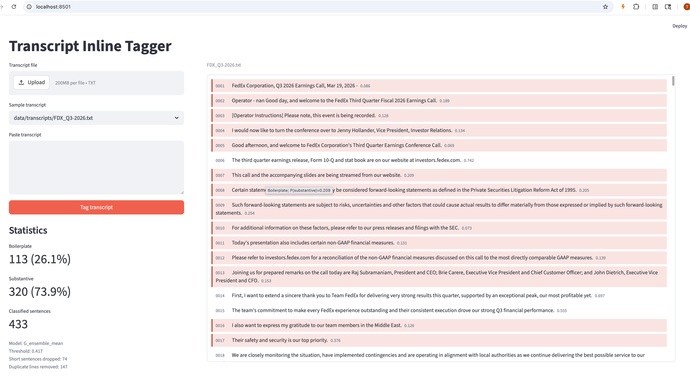

# BPClassifier Engineering Report

## Introduction

This project builds a sentence-level classifier for earnings-call transcripts, separating boilerplate sentences from substantive business content. The operational framing is recall-first: the downstream user can tolerate some extra boilerplate, but missing substantive guidance, financial detail, strategy, or Q&A content is costly. I therefore tuned thresholds to satisfy a substantive-recall floor before optimizing macro-F1, then shipped the selected model through a Streamlit GUI that highlights boilerplate inline in the transcript flow.

## Gold-standard methodology

The raw corpus is the transcript directory under `data/transcripts`. The extraction pipeline reads each `.txt` file, removes repeated lines within a transcript, splits paragraph blocks at blank lines and known transcript section headers, tokenizes sentences with NLTK, normalizes whitespace, and drops sentences shorter than 40 characters. The full extraction produced 55,485 candidate sentences.

The gold set contains 3,000 sentences sampled from the sentence pool with a fixed random seed of 42 and stratification by source transcript. The final class balance in the frozen table is 945 boilerplate sentences and 2,055 substantive sentences, or 31.5% boilerplate and 68.5% substantive. The train/validation/test split is transcript-level, 60/20/20 by transcript count, and stratified by each transcript's majority label. This produced 1,826 train, 631 validation, and 543 test sentences; the test set was held out from model selection.

Labeling used three local Ollama judges: `llama3.1:8b`, `qwen3:8b-q4_K_M`, and `gemma2:9b`. All judges received the same rubric in `data/docs/labeling_rubric.md` and had to emit JSON with only `boilerplate` or `substantive`. The rubric includes anchors for operator logistics, safe-harbor language, generic thanks, analyst-name intros, numeric results, guidance, strategy, Q&A specifics, one-word answers, and mixed sentences. The ambiguity rule is deliberately recall-oriented: if a sentence remains genuinely ambiguous, label it substantive.

The three judges unanimously agreed on 63.7% of rows. The remaining 36.3% were all 2-1 disagreements and were arbitrated by Claude Haiku 4.5 using the same rubric, for 1,089 API calls. Pairwise agreement was 0.654, 0.788, and 0.832 across the three local judges. No judge parse fallbacks and no non-empty API errors were recorded in the final cached run.

A stratified manual audit of 40 disagreement rows is documented in `data/docs/gold_disagreement_audit.md` and `data/docs/gold_disagreement_audit.tsv`. The audit agreed with the frozen `gold_final` label on 30 rows and recommended 10 corrections, all boilerplate-to-substantive. Those corrections were not folded into `cache/gold_labeled.parquet` before the final model run, because that would require retraining the zoo and regenerating the leaderboard. This is a real limitation of the final artifacts; the report and README keep the evaluated target as the frozen table and record the audit corrections for a future rerun.

## Feature engineering

The handcrafted feature matrix has 30 earnings-call features, implemented in `src/handcrafted_features.py`. Boilerplate-oriented flags cover host/operator language, analyst-firm introductions, greetings, welcomes, turn-taking, next-question cues, replay/webcast/press-release references, safe-harbor language, SEC/Regulation FD references, generic thanks, and generic praise. Substantive-oriented flags cover weak forward-looking-modal patterns, dollar signs, percentages, digit density, magnitude words, basis points, quarter/sequential/year-over-year wording, margin/EPS/EBITDA/revenue/guidance/outlook terms, enumerated points, numbered steps, corporate actions, and restructuring/headcount language. Continuous features include character length, short-answer indicator, question mark, exclamation count, punctuation density, and uppercase-run ratio.

The rule baseline uses a weighted score from these columns and maps it through a logistic function. The linear and tree models concatenate frozen `sentence-transformers/all-MiniLM-L6-v2` embeddings with the 30 handcrafted features. FastText, FinBERT, and SetFit use sentence text directly but are evaluated on the same frozen labels, transcript-level splits, threshold protocol, and test set.

## Classifier-zoo results

Rows are ordered by test macro-F1, as required by the handout. The chosen deployment winner is not the top macro-F1 row; it is the highest-macro-F1 eligible row after enforcing the substantive recall floor on test, matching the stricter grading-rubric wording.

| Family | Test accuracy | Macro-F1 | Boilerplate F1 | Substantive F1 | Substantive recall | Threshold | Fold threshold std | Train seconds | Approx. infer sent/s |
|---|---:|---:|---:|---:|---:|---:|---:|---:|---:|
| E_finbert | 0.890 | 0.867 | 0.811 | 0.922 | 0.949 | 0.148 | 0.071 | 88.8 | 551 |
| F_setfit | 0.867 | 0.841 | 0.776 | 0.906 | 0.928 | 0.028 | 0.019 | 886.9 | 3,319 |
| G_ensemble_mean | 0.856 | 0.816 | 0.729 | 0.902 | 0.965 | 0.417 | 0.020 | 0.0 | 31,091 |
| C_histgb_enriched | 0.843 | 0.802 | 0.712 | 0.893 | 0.946 | 0.337 | 0.025 | 6.7 | 186,631 |
| H_ensemble_rankmean | 0.842 | 0.799 | 0.705 | 0.892 | 0.949 | 0.288 | 0.016 | 0.0 | 31,091 |
| B_logreg_enriched | 0.818 | 0.750 | 0.621 | 0.880 | 0.973 | 0.016 | 0.021 | 0.2 | 67,255 |
| D_fasttext | 0.814 | 0.747 | 0.616 | 0.877 | 0.968 | 0.103 | 0.059 | 1.3 | 84,309 |
| A_rules | 0.689 | 0.506 | 0.207 | 0.806 | 0.944 | 0.276 | 0.002 | 0.0 | 13,207,820 |

Rules + regex were extremely fast and interpretable, but they missed many boilerplate cases because vague business-sounding sentences often lack explicit housekeeping phrases. Logistic regression on frozen embeddings plus handcrafted features was strong on substantive recall but needed a very low threshold, which caused many boilerplate false positives. The HistGradientBoosting model improved boilerplate precision and macro-F1 by using nonlinear interactions between embeddings and regex flags, but it still missed the 0.96 test-recall floor. FastText was small and fast, and its n-gram features worked well for recall, but it confused generic corporate language with substantive content. FinBERT produced the best test macro-F1 and boilerplate F1, but at its OOF-selected threshold it reached only 0.949 substantive recall on test and was therefore ineligible under the stricter test-floor interpretation. SetFit was competitive but also fell below the test recall floor. The mean-probability ensemble over the top non-transformer members traded some boilerplate F1 for substantive recall and became the saved GUI winner.

## Recall-constrained threshold selection

Thresholds were selected from 5-fold out-of-fold probabilities on the combined train+validation set. Only thresholds with substantive recall at least 0.96 were eligible; among eligible thresholds, macro-F1 was maximized. The selected winner is `G_ensemble_mean`, the arithmetic mean of `P(substantive)` from `C_histgb_enriched`, `B_logreg_enriched`, `D_fasttext`, and `A_rules`. Its threshold is 0.417, and the fold-level threshold standard deviation is 0.020.

For the winner, the held-out test metrics are:

| Class | Precision | Recall | F1 | Support |
|---|---:|---:|---:|---:|
| Boilerplate | 0.890 | 0.618 | 0.729 | 170 |
| Substantive | 0.847 | 0.965 | 0.902 | 373 |
| Overall accuracy |  |  | 0.856 | 543 |
| Macro average |  |  | 0.816 | 543 |

Confusion matrix for `G_ensemble_mean`, with rows as gold labels and columns as predicted labels:

| Gold \\ Predicted | Boilerplate | Substantive |
|---|---:|---:|
| Boilerplate | 105 | 65 |
| Substantive | 13 | 360 |

The result satisfies the substantive recall floor on the held-out test set: 360 of 373 substantive sentences were retained, for recall 0.965.

## Error analysis

Most false positives are boilerplate-labeled sentences that sound like strategy or business commentary. Examples include: "Our fourth quarter performance marks a strong end to a year of successful execution"; "This business has tremendous potential with both new and existing clients, and we're really leaning into it"; and "While many companies can build prototypes, the leap from prototype to production is substantial." These are difficult because they use substantive vocabulary but are broad, promotional, or unsupported by concrete numbers. Some may also be label-noise candidates under the recall-oriented rubric.

False negatives are more concerning because they represent substantive misses. Examples include: "Organizational complexity and bureaucracies have been suffocating the innovation and agility we need to win"; "I must say I have been pleased with the teams and the progress we have made transitioning to a financially disciplined foundry..."; and "So from a domestic perspective, we're not -- and I'm speaking specifically to parcel." These misses tend to be qualitative strategy or operational sentences without digits, explicit financial terms, or strong domain keywords. They reflect feature gaps: the model is strongest on numeric/guidance language and weaker on material but qualitative operational commentary.

The manual audit also exposed label quality risk: all 10 recommended corrections in the audited disagreement sample moved from boilerplate to substantive. That pattern is consistent with the assignment's recall-first objective and suggests the next improvement should be applying the audit corrections, auditing a larger disagreement sample, and rerunning the model zoo.

## GUI screenshot

The GUI is implemented in `gui/app.py`. It loads `cache/zoo_winner/winner_manifest.json` and `winner_threshold.txt` at startup, supports file upload, sample-transcript selection, and pasted transcript text, then shows every extracted sentence inline. Boilerplate sentences use the course convention of a red-tinted background, while substantive sentences remain plain. The statistics panel shows boilerplate count, substantive count, percentages, total classified sentences, model ID, threshold, short dropped sentences, and duplicate-line removals.



## Reproducibility

From a clean checkout with the provided cached artifacts, install dependencies and start the GUI:

```bash
pip install -r requirements.txt
streamlit run gui/app.py
```

If the default Streamlit port is busy:

```bash
streamlit run gui/app.py --server.port 8502
```

To recreate the gold-standard pipeline, run Ollama locally with the three configured judge models and set `ANTHROPIC_API_KEY`, then execute:

```bash
python gold_standard.py --mode full --use-api-check --random-seed 42
```

To recreate the classifier zoo and saved winner from `cache/gold_labeled.parquet`:

```bash
python - <<'PY'
from src.model_config import ZooRunConfig
from src.project_notebook import run_classifier_zoo_report

cfg = ZooRunConfig.for_8gb_gpu(show_progress=True)
run_classifier_zoo_report(cfg=cfg)
PY
```

The notebook `notebooks/project.ipynb` wraps the same pipeline helpers for an end-to-end interactive run. Unit tests can be run with:

```bash
pytest -q
```

The final verification run for this submission was `33 passed in 1.39s`.

## Citations and LLM-assistance disclosure

Libraries and models used: scikit-learn, NLTK, pandas, NumPy, PyArrow, sentence-transformers with `sentence-transformers/all-MiniLM-L6-v2`, FastText, Hugging Face Transformers and Datasets, ProsusAI FinBERT, SetFit, PyTorch, Streamlit, Ollama, Anthropic Claude Haiku 4.5, and OpenAI Codex.

LLM assistance disclosure: local Ollama models and Claude Haiku were used for gold-label judging as described above. OpenAI Codex assisted with the final repository audit, report drafting, README drafting, and cleanup planning; all reported metrics were taken from the repository's cached artifacts and code, not fabricated.
